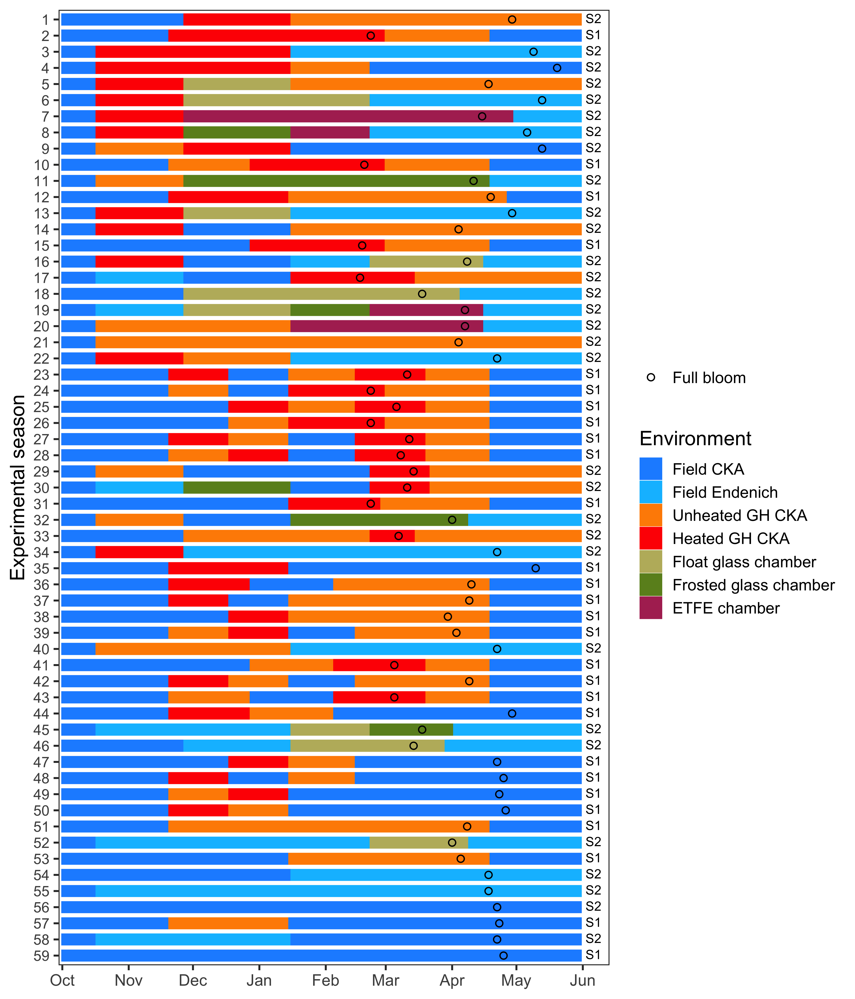

<style>
body {
text-align: justify}
</style>

```{r, warning = F, include = F}
#install and load packages
library(decisionSupport)
library(gridExtra)
library(tidyverse)

# Load the environment with final results from the folder
load("fitting_09_nov_final.RData")
```

[^*]: Eduardo Fernández (efernand@uni-bonn.de)

# Introduction

Phenology models are crucial tools for assessing the impacts of climate change on forestry, ecology and agriculture. In the article 'Unusually warm winter seasons may compromise the performance of current phenology models - Predicting bloom dates in young apple trees with `PhenoFlex`', we assessed the performance of the recently proposed `PhenoFlex` phenology modelling framework [@Luedeling2021] in response to different characteristics of the calibration data. In this document, we provide supplementary materials to the main document. Among these, we highlight the specific set of parameters used in each of the ten model runs as well as the results of our supplementary validation of one of the versions of the framework used in the study (i.e. Phenoflex\textsubscript{excluded}).

# Detailed description of the experimental design

In this study, we used a subset of phenology and weather records reported on in an earlier study by @Fernandez2021. In this section, we explain the experimental design and show the environmental conditions used in the study. During two consecutive winters, we exposed young apple trees to several environments at different times (Fig. S1).

```{r fig_s1, echo = FALSE, fig.cap = "Conditions used in the experiment during the first year", out.width = "100%", fig.align = 'center'}
knitr::include_graphics("figures/supplementary_conditions_3.png")
```

By frequently transferring the trees among the environments shown in Fig. S1 plus four additional environments in the second winter season (i.e. field conditions at Campus Endenich and 3 chambers covered with different materials), we were able to generate 59 experimental seasons and evaluate the phenology of the trees after exposure to these conditions (Fig. S2).

```{r fig_s2, echo = FALSE, fig.cap = "Experimental seasons used in the study. The first 5 experimental seasons represent the marginal experimental seasons excluded in the respective version of the analysis (see main manuscript for further details). In the 'Environment' legend, CKA stands for Campus Klein-Altendorf and ETFE stands for ethylene-tetrafluoroethylenecopolymer", out.height = "71%", fig.align = 'center'}

```

The experimental setup allowed us to generate a substantial temperature variation during the two winter seasons as well as conditions that may have been marginal for apple trees to overcome dormancy as discussed in the main manuscript. Most of the time, the mean temperature in those 5 marginal experimental seasons was in the upper part of the temperature range identified among all experimental seasons (Fig. S3).

\newpage

```{r fig_s3, echo = FALSE, fig.cap = "Temperature variation among the experimental seasons used in this study. Whereas the solid red line in the plot shows the mean temperature among marginal experimental seasons (1 in the winter of 2018/2019 and 4 in the winter of 2019/2020), the blue solid line represents the mean temperature among all available experimental seasons (i.e. 59)", out.width = "90%", fig.align = 'center'}

```

# Parameters used in each model run

The `phenologyFitter()` function from the `chillR` package [@R-chillR], which is needed to fit the 12 model parameters to data, requires an estimated set of parameters (i.e. `par.guess`) as well as the `lower` and `upper` bounds for these values. We initialized the model fitting procedure with a common set of parameters for both versions of the analysis (i.e. PhenoFlex\textsubscript{all} and PhenoFlex\textsubscript{excluded}).

## First model run

```{r initial_par}
# Set the initial parameters (wide ranges)
# Parameter <- c(yc,  zc,  s1, Tu,     E0,      E1,     A0,         A1,  Tf, Tc, Tb, slope)
lower       <- c(20, 100, 0.1,  0, 3000.0,  9000.0, 6000.0,   5.00e+13,   0,  0,  0,  0.05)
par.guess   <- c(40, 190, 0.5, 25, 3372.8,  9900.3, 6319.5,   5.94e+13,   4, 36,  4,  1.60)
upper       <- c(80, 500, 1.0, 30, 4000.0, 10000.0, 7000.0,   6.00e+13,  10, 40, 10, 50.00)
```

We introduced these parameters to the fitter function for each version of the analysis. Note that the specific values for the parameters and all scripts developed in this study are deposited in a public online repository [(https://github.com/EduardoFernandezC/phenoflex_exp_data)](https://github.com/EduardoFernandezC/phenoflex_exp_data). The first fitting procedure resulted in `RMSE` values of `r round(RMSEP_calib_v1_r1, 2)` days for PhenoFlex\textsubscript{all} and `r round(RMSEP_calib_v2_r1, 2)` days for PhenoFlex\textsubscript{excluded}. In the second round of the fitting procedure, we adjusted the parameter inputs.

## Second model run

```{r second_par}
# Set the parameters using the results from the previous run

# Version PhenoFlex_all (pheno_fit_v1_r1$model_fit$par)
# Parameter <- c(yc,  zc,   s1,   Tu,     E0,      E1,     A0,       A1,   Tf,   Tc,  Tb, slope)
lower_v1_r2 <- c(45, 290, 0.00, 18.0, 3000.0,  9000.0, 6000.0, 5.20e+13,  0.0, 29.0,  0.0,  0.05)
par_v1_r2   <- c(59, 326, 0.16, 22.5, 3309.9,  9900.1, 6295.7, 5.94e+13,  6.1, 39.9,  8.6, 14.60)
upper_v1_r2 <- c(65, 380, 0.50, 30.0, 4000.0, 10000.0, 7000.0, 6.20e+13, 10.0, 44.0, 12.0, 30.00)


# Same for version PhenoFlex_excluded (pheno_fit_v2_r1$model_fit$par)
# Parameter <- c(yc,  zc,   s1,   Tu,     E0,      E1,     A0,       A1,   Tf,   Tc,   Tb, slope)
lower_v2_r2 <- c(25, 340, 0.00, 17.0, 3000.0,  9000.0, 6000.0, 5.20e+13,  0.0, 30.0,  0.0,  1.00)
par_v2_r2   <- c(35, 387, 0.03, 21.8, 3371.0,  9900.8, 6283.6, 5.94e+13,  5.1, 40.0,  6.3, 40.00)
upper_v2_r2 <- c(40, 420, 0.50, 32.0, 4000.0, 10000.0, 7000.0, 6.20e+13, 10.0, 42.0, 10.0, 50.00)

```

In the second round of the fitting procedure, PhenoFlex\textsubscript{all} reached an `RMSE` of `r round(RMSEP_calib_v1_r2, 2)` days, whereas PhenoFlex\textsubscript{excluded} reached an `RMSE` of `r round(RMSEP_calib_v2_r2, 2)` days. In the third round of the fitting procedure, we adjusted the parameter inputs as follow:

## Third model run

```{r third_par}
# Set the parameters using the results from the previous run

# Version PhenoFlex_all (pheno_fit_v1_r2$model_fit$par)
# Parameter <- c(yc, zc,    s1,   Tu,     E0,      E1,     A0,       A1,   Tf,   Tc,   Tb, slope)
lower_v1_r3 <- c(48, 290, 0.00, 15.0, 3000.0,  9000.0, 6000.0, 5.20e+13,  0.0, 24.0,  0.0,  0.05)
par_v1_r3   <- c(58, 332, 0.39, 22.1, 3310.5,  9900.3, 6344.8, 5.94e+13,  7.2, 35.0,  8.8, 18.20)
upper_v1_r3 <- c(68, 370, 0.65, 32.0, 4000.0, 10500.0, 7000.0, 6.20e+13, 11.0, 44.0, 11.0, 35.00)


# Same for PhenoFlex_excluded (pheno_fit_v2_r2$model_fit$par)
# Parameter <- c(yc, zc,    s1,   Tu,     E0,      E1,     A0,       A1,   Tf,   Tc,   Tb, slope)
lower_v2_r3 <- c(20, 350, 0.00, 18.0, 3000.0,  9000.0, 6000.0, 5.20e+13,  0.0, 30.0,  0.0,  1.00)
par_v2_r3   <- c(34, 406, 0.20, 21.4, 3371.4,  9901.3, 6214.0, 5.94e+13,  1.5, 42.0,  6.1, 10.70)
upper_v2_r3 <- c(50, 450, 0.55, 35.0, 4000.0, 10500.0, 7000.0, 6.20e+13, 10.0, 46.0, 10.0, 35.00)

```

After the third round of the fitting procedure, `RMSE` values decreased to `r round(RMSEP_calib_v1_r3, 2)` days for PhenoFlex\textsubscript{all} and `r round(RMSEP_calib_v2_r2, 2)` days for PhenoFlex\textsubscript{excluded}. In the fourth round of the fitting procedure, we used the following set of parameters:

## Fourth model run

```{r fourth_par}
# Set the parameters using the results from the previous run

# Version PhenoFlex_all (pheno_fit_v1_r3$model_fit$par)
# Parameter <- c(yc,  zc,   s1,   Tu,     E0,      E1,     A0,       A1,   Tf,   Tc,   Tb, slope)
lower_v1_r4 <- c(45, 290, 0.00, 15.0, 3000.0,  9000.0, 5500.0, 5.20e+13,  0.0, 20.0,  0.0,  1.00)
par_v1_r4   <- c(60, 339, 0.54, 23.0, 3310.3,  9901.5, 6346.3, 5.94e+13,  7.2, 30.7,  7.6,  7.30)
upper_v1_r4 <- c(70, 370, 0.75, 32.0, 4000.0, 10300.0, 7000.0, 6.20e+13, 12.0, 40.0, 12.0, 20.00)


# Same for version 2 (pheno_fit_v2_r3$model_fit$par)
# Parameter <- c(yc, zc,    s1,   Tu,     E0,      E1,     A0,       A1,   Tf,   Tc,   Tb, slope)
lower_v2_r4 <- c(28, 360, 0.00, 17.0, 3000.0,  9300.0, 5800.0, 5.30e+13,  0.0, 35.0,  0.0, 10.00)
par_v2_r4   <- c(34, 396, 0.20, 21.6, 3371.0,  9901.3, 6214.0, 5.94e+13,  1.5, 46.0,  5.9, 11.12)
upper_v2_r4 <- c(44, 440, 0.45, 30.0, 4000.0, 10500.0, 6800.0, 6.50e+13, 10.0, 48.0, 12.0, 40.00)
```

In this round of the fitting procedure, PhenoFlex\textsubscript{all} reached an `RMSE` of `r round(RMSEP_calib_v1_r4, 2)` days, whereas PhenoFlex\textsubscript{excluded} reached an `RMSE` of `r round(RMSEP_calib_v2_r4, 2)` days.

## Fifth model run

```{r fifth_par}
# Set the parameters using the results from the previous run
# Version PhenoFlex_all (pheno_fit_v1_r4$model_fit$par)
# Parameter <- c(yc,  zc,   s1,   Tu,     E0,      E1,     A0,       A1,   Tf,   Tc,   Tb, slope)
lower_v1_r5 <- c(50, 330, 0.00, 18.0, 3000.0,  9600.0, 6000.0, 5.50e+13,  2.0, 30.0,  2.0,  0.50)
par_v1_r5   <- c(60, 354, 0.47, 22.8, 3310.3,  9901.5, 6344.3, 5.94e+13,  7.2, 36.0,  7.6,  7.63)
upper_v1_r5 <- c(75, 370, 0.55, 28.0, 4000.0, 10300.0, 7000.0, 6.50e+13, 10.0, 42.0, 12.0, 15.00)


# Same for version PhenoFlex (pheno_fit_v2_r4$model_fit$par)
# Parameter <- c(yc,  zc,   s1,   Tu,     E0,      E1,     A0,       A1,   Tf,   Tc,   Tb, slope)
lower_v2_r5 <- c(27, 360, 0.00, 18.0, 3000.0,  9500.0, 5800.0, 5.50e+13,  0.0, 35.0,  1.0,  1.00)
par_v2_r5   <- c(34, 383, 0.21, 22.5, 3371.0,  9901.3, 6213.9, 5.94e+13,  1.5, 45.6,  5.9,  1.08)
upper_v2_r5 <- c(37, 400, 0.55, 32.0, 4000.0, 10300.0, 6800.0, 6.30e+13,  8.0, 48.0, 10.0, 25.00)
```

In this round of the fitting procedure, PhenoFlex\textsubscript{all} reached an `RMSE` of `r round(RMSEP_calib_v1_r5, 2)` days, whereas PhenoFlex\textsubscript{excluded} reached an `RMSE` of `r round(RMSEP_calib_v2_r5, 2)` days.

## Sixth model run

```{r sixth_par}
# Set the parameters using the results from the previous run
# Version PhenoFlex_all (pheno_fit_v1_r5$model_fit$par)
# Parameter <- c(yc,  zc,   s1,   Tu,     E0,      E1,     A0,       A1,   Tf,   Tc,   Tb, slope)
lower_v1_r6 <- c(40, 290, 0.00, 18.0, 2900.0,  9000.0, 5700.0, 5.30e+13,  0.0, 20.0,  0.0,  0.01)
par_v1_r6   <- c(60, 343, 0.32, 25.1, 3310.3,  9901.6, 6342.9, 5.94e+13,  5.6, 33.6,  7.0,  2.24)
upper_v1_r6 <- c(80, 390, 0.55, 32.0, 3900.0, 10500.0, 6900.0, 6.80e+13, 12.0, 48.0, 12.0, 20.00)


# Same for version PhenoFlex_excluded (pheno_fit_v2_r5$model_fit$par)
# Parameter <- c(yc,  zc,   s1,   Tu,     E0,      E1,     A0,       A1,   Tf,   Tc,   Tb, slope)
lower_v2_r6 <- c(25, 330, 0.00, 18.0, 3000.0,  9200.0, 5700.0, 5.40e+13,  0.05, 40.0,  0.0,  0.50)
par_v2_r6   <- c(35, 361, 0.15, 22.4, 3371.0,  9901.3, 6213.8, 5.94e+13,  1.45, 48.0,  5.9,  1.10)
upper_v2_r6 <- c(40, 390, 0.35, 30.0, 4000.0, 10800.0, 6900.0, 6.60e+13, 10.00, 50.0, 10.0, 20.00)
```

In this round of the fitting procedure, PhenoFlex\textsubscript{all} reached an `RMSE` of `r round(RMSEP_calib_v1_r6, 2)` days, whereas PhenoFlex\textsubscript{excluded} reached an `RMSE` of `r round(RMSEP_calib_v2_r6, 2)` days.

## Seventh model run

```{r seventh_par}
# Set the parameters using the results from the previous run
# Version PhenoFlex_all (pheno_fit_v1_r6$model_fit$par)
# Parameter <- c(yc,  zc,   s1,   Tu,     E0,      E1,     A0,       A1,   Tf,   Tc,   Tb, slope)
lower_v1_r7 <- c(55, 325, 0.00, 20.0, 3000.0,  9000.0, 5500.0, 5.50e+13,  0.0, 30.0,  2.0,  0.00)
par_v1_r7   <- c(61, 334, 0.53, 25.0, 3310.3,  9901.6, 6342.7, 5.94e+13,  6.4, 33.9,  7.0,  1.57)
upper_v1_r7 <- c(65, 345, 0.65, 30.0, 4000.0, 10500.0, 6600.0, 6.50e+13, 10.0, 40.0, 10.0, 10.00)


# Same for version PhenoFlex_excluded (pheno_fit_v2_r6$model_fit$par)
# Parameter <- c(yc,  zc,   s1,   Tu,     E0,      E1,     A0,       A1,   Tf,   Tc,   Tb, slope)
lower_v2_r7 <- c(30, 365, 0.000, 20.0, 3000.0,  9500.0, 5800.0, 5.50e+13,  0.0, 35.0,  0.0,  1.00)
par_v2_r7   <- c(34, 380, 0.160, 26.4, 3371.0,  9901.3, 6214.2, 5.94e+13,  1.3, 41.2,  3.3,  1.12)
upper_v2_r7 <- c(40, 385, 0.225, 30.0, 4000.0, 10500.0, 6800.0, 6.40e+13,  6.0, 45.0,  8.0, 20.00)
```

In this round of the fitting procedure, PhenoFlex\textsubscript{all} reached an `RMSE` of `r round(RMSEP_calib_v1_r7, 2)` days, whereas PhenoFlex\textsubscript{excluded} reached an `RMSE` of `r round(RMSEP_calib_v2_r7, 2)` days.

## Eigth model run

```{r eigth_par}
# Set the parameters using the results from the previous run
# Version PhenoFlex_all (pheno_fit_v1_r7$model_fit$par)
# Parameter <- c(yc,  zc,   s1,   Tu,     E0,      E1,     A0,       A1,   Tf,   Tc,   Tb, slope)
lower_v1_r8 <- c(55, 315, 0.30, 22.0, 2800.0,  9500.0, 5900.0, 5.60e+13,  2.0, 26.0,  2.0,  0.00)
par_v1_r8   <- c(62, 336, 0.52, 27.1, 3310.3,  9901.7, 6395.4, 5.94e+13,  6.5, 30.2,  5.6,  1.39)
upper_v1_r8 <- c(70, 355, 0.70, 32.0, 3800.0, 10200.0, 6700.0, 6.40e+13,  9.0, 36.0,  8.0, 15.00)


# Same for version PhenoFlex_excluded (pheno_fit_v2_r7$model_fit$par)
# Parameter <- c(yc,  zc,   s1,   Tu,     E0,      E1,     A0,       A1,   Tf,   Tc,   Tb, slope)
lower_v2_r8 <- c(28, 345, 0.01, 20.0, 2800.0,  9600.0, 5800.0, 5.60e+13,  0.0, 38.0,  0.0,  7.00)
par_v2_r8   <- c(35, 375, 0.13, 26.4, 3371.0,  9901.3, 6214.4, 5.94e+13,  1.3, 44.7,  3.0,  1.80)
upper_v2_r8 <- c(40, 405, 0.30, 30.2, 3700.0, 10300.0, 6800.0, 6.30e+13,  8.0, 52.0,  8.0, 30.00)
```

In this round of the fitting procedure, PhenoFlex\textsubscript{all} reached an `RMSE` of `r round(RMSEP_calib_v1_r8, 2)` days, whereas PhenoFlex\textsubscript{excluded} reached an `RMSE` of `r round(RMSEP_calib_v2_r8, 2)` days.

## Ninth model run

```{r ninth_par}
# Set the parameters using the results from the previous run
# Version PhenoFlex_all (pheno_fit_v1_r8$model_fit$par)
# Parameter <- c(yc,  zc,   s1,   Tu,     E0,      E1,     A0,       A1,   Tf,   Tc,   Tb, slope)
lower_v1_r9 <- c(55, 300, 0.50, 20.0, 3000.0,  9500.0, 5500.0, 5.00e+13,  1.0, 20.0,  2.0,  0.00)
par_v1_r9   <- c(63, 315, 0.70, 27.9, 3310.3,  9901.7, 6396.2, 5.94e+13,  6.5, 27.9,  5.7,  1.39)
upper_v1_r9 <- c(75, 325, 0.85, 35.0, 4000.0, 10500.0, 6900.0, 7.00e+13, 11.0, 37.0, 10.0, 25.00)


# Same for version PhenoFlex_excluded (pheno_fit_v2_r8$model_fit$par)
# Parameter <- c(yc,  zc,   s1,   Tu,     E0,      E1,     A0,       A1,   Tf,   Tc,   Tb, slope)
lower_v2_r9 <- c(23, 325, 0.00, 16.0, 3000.0,  9500.0, 5700.0, 5.60e+13,  0.0, 40.0,  0.0,  1.00)
par_v2_r9   <- c(34, 357, 0.14, 26.8, 3371.0,  9901.2, 6214.1, 5.94e+13,  1.4, 51.3,  3.6,  8.45)
upper_v2_r9 <- c(43, 375, 0.50, 36.0, 3800.0, 10500.0, 6700.0, 6.30e+13, 10.0, 55.0, 10.0, 20.00)
```

In this round of the fitting procedure, PhenoFlex\textsubscript{all} reached an `RMSE` of `r round(RMSEP_calib_v1_r9, 2)` days, whereas PhenoFlex\textsubscript{excluded} reached an `RMSE` of `r round(RMSEP_calib_v2_r9, 2)` days.

## Tenth model run

```{r tenth_par}
# Set the parameters using the results from the previous run
# Version PhenoFlex_all (pheno_fit_v1_r9$model_fit$par)
# Parameter  <- c(yc,  zc,   s1,   Tu,     E0,      E1,     A0,       A1,   Tf,   Tc,   Tb, slope)
lower_v1_r10 <- c(58, 305, 0.15, 20.0, 2800.0,  9500.0, 5800.0, 5.70e+13,  0.0, 20.0,  0.0,  0.00)
par_v1_r10   <- c(63, 319, 0.85, 27.9, 3310.4,  9901.6, 6396.2, 5.94e+13,  6.5, 27.9,  5.6,  1.39)
upper_v1_r10 <- c(68, 335, 1.05, 35.0, 3700.0, 10400.0, 6600.0, 6.20e+13, 12.0, 34.0, 10.0, 15.00)


# Same for version PhenoFlex_excluded (pheno_fit_v2_r9$model_fit$par)
# Parameter  <- c(yc,  zc,    s1,   Tu,     E0,      E1,     A0,       A1,   Tf,   Tc,   Tb, slope)
lower_v2_r10 <- c(28, 360, 0.050, 20.0, 2900.0,  9500.0, 5800.0, 5.70e+13,  0.0, 45.0,  0.0,  0.00)
par_v2_r10   <- c(34, 371, 0.130, 25.0, 3371.0,  9901.3, 6214.6, 5.94e+13,  1.7, 53.3,  4.0,  3.17)
upper_v2_r10 <- c(38, 380, 0.325, 30.0, 3700.0, 10400.0, 6600.0, 6.20e+13, 10.0, 58.0, 10.0, 15.00)
```

In this round of the fitting procedure, PhenoFlex\textsubscript{all} reached an `RMSE` of `r round(RMSEP_calib_v1_r10, 2)` days, whereas PhenoFlex\textsubscript{excluded} reached an `RMSE` of `r round(RMSEP_calib_v2_r10, 2)` days. Note that the `RMSE` values obtained in this run did not improve compared to the results of run number 9. For this reason, we used the parameters estimated in the ninth run as final values.

# Supplementary validation of PhenoFlex\textsubscript{excluded}

As mentioned in the main text, we assessed the performance of the PhenoFlex\textsubscript{excluded} version when used to predict bloom dates in the marginal seasons. Following this approach, we aimed to test the viability of extrapolating the modelling framework to conditions outside the calibration data set. The results of this analysis demonstrated the importance of explicitly testing the predictive accuracy of the model under environmental conditions outside the range of the calibration data. When comparable temperature conditions are used for calibration and validation, the model is, despite potentially incorrect assumptions, sufficiently flexible to be well fitted to data and shows good projection quality. However, when validation data contain conditions outside the calibration range, the conceivably inaccurate model structure cannot be compensated by parameter fitting and finds expression in high residual errors (Fig. S1). In this validation, RMSE and RPIQ reached values of 61.2 days and 0.3, respectively. It should be noted, however, that these results are greatly influenced by one outlier showing 127 days of error (observed versus predicted). When removing the outlier from the marginal seasons, the prediction error ranged between 9.3 and 44.4 days (Fig. S1).

```{r fig_s4, echo = FALSE, fig.cap = "Validation of the PhenoFlex version using the five marginal seasons excluded from the calibration data set. Whereas the open blue circles represent the experimental seasons used for calibration, the filled red circles represent the five marginal seasons used for validating the framework. The vertical lines in the marginal season dots represent the uncertainty estimated by bootstrapping.", out.width = "100%", fig.align = 'center'}

```

\newpage

# References
